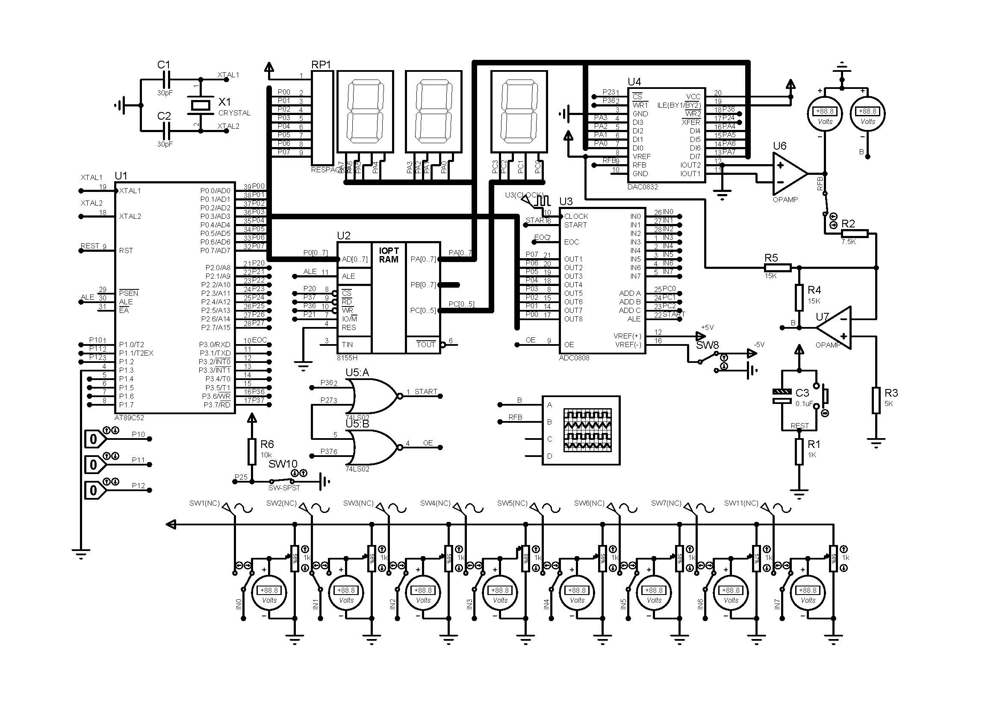

# 计算机控制课程设计

## 简要说明

本工程为基于C52系列单片机开发的数模转换课程设计

## 设计思路

本程序采用了模块化设计思路，为每个元件撰写相应驱动，需要调用时包含头文件即可。同时将初始化与数据刷新功能拆分，分别封装在两个文件中，使得主函数结构简单。

~~~C
void main()
{
    Init();
    while (1)
    {
        reflash();
        delay_nms(50);
    }
}
~~~

同时为了方便测试多种滤波方式。在独立文件中实现十一种滤波方案后，将多种滤波函数封装到一个函数指针数组内，滤波功能由函数指针数组提供,故存在由外部切换滤波方式的接口。同时也可直接调用函数本身。滤波功能仅需包含对应的头文件`voltCalc.h`。

~~~C
uchar (*filtFuns[11]) () = 
{
avgFilt,
slideavgFilt,
speedFilt,
amplimtFilt,
midFilt,
midavgFilt,
limtvgFilt,
onlastFilt,
weislidFlit,
debFilt,
debavgFilt,
};
~~~

功能依次为：
| 序号 | 功能         | 函数               |
| ---- | ------------ | -------------------- |
| 0    | 平均值滤波   | `uchar avgFilt()`    |
| 1    | 滑动平均滤波 | `uchar slideavgFilt()` |
| 2    | 限速滤波     | `uchar speedFilt()`    |
| 3    | 限幅滤波     | `uchar amplimtFilt()`  |
| 4    | 中位数滤波   | `uchar midFilt()`      |
| 5    | 中位平均滤波 | `uchar midavgFilt()`   |
| 6    | 限幅平均滤波 | `uchar limtvgFilt()`   |
| 7    | 一阶滞后滤波 | `uchar onlastFilt()`  |
| 8    | 加权递推     | `uchar weislidFlit()`  |
| 9    | 消抖滤波     | `uchar debFilt()`      |
| 10   | 限幅消抖滤波 | `uchar debavgFilt()`   |

函数指针调用位置:`reflash.c`

~~~C
...
if (tmport =! port)
{
    delay_nms(100);
    volt = getVolt();
    tmport = port;
}
else
{
    volt = filtFuns[port+4]();
}
...
~~~

## 文件简介

### ADC0808 DAC0832 IO8155

相关`.c`文件与`.h`文件，为各个元件的驱动程序，包含初始化函数与数据调用函数.
以8155为例

~~~C
void Init8155();//8155初始化程序
void pushVolt();//推送电压到A通道
void pushPort();//推送待测量端口到C通道
~~~

详情见源文件

### reflash

相关`.c`文件与`.h`文件，定义了数据更新函数

~~~C
void reflash()
~~~

每执行一次，函数将读取当前通道设置状态，若为自动则在数据刷新一定次数后自动循环切换通道。而后根据通道设置状态读取对应电压，输出到DAC并启动转换。

### init

相关`.c`文件与`.h`文件，定义了初始化函数

~~~C
void Init()
~~~

函数将设置各个元件到初始工作状态

### voltCalc

相关`.c`文件与`.h`文件，定义了一系列滤波函数，并用一个函数指针数组封装。同时各个函数也可直接调用。

~~~C
uchar (*filtFuns[11]) () = 
{
avgFilt,
slideavgFilt,
speedFilt,
amplimtFilt,
midFilt,
midavgFilt,
limtvgFilt,
onlastFilt,
weislidFlit,
debFilt,
debavgFilt,
};
~~~

功能依次为：
| 序号 | 功能         | 函数               |
| ---- | ------------ | -------------------- |
| 0    | 平均值滤波   | `uchar avgFilt()`    |
| 1    | 滑动平均滤波 | `uchar slideavgFilt()` |
| 2    | 限速滤波     | `uchar speedFilt()`    |
| 3    | 限幅滤波     | `uchar amplimtFilt()`  |
| 4    | 中位数滤波   | `uchar midFilt()`      |
| 5    | 中位平均滤波 | `uchar midavgFilt()`   |
| 6    | 限幅平均滤波 | `uchar limtvgFilt()`   |
| 7    | 一阶滞后滤波 | `uchar onlastFilt()`  |
| 8    | 加权递推     | `uchar weislidFlit()`  |
| 9    | 消抖滤波     | `uchar debFilt()`      |
| 10   | 限幅消抖滤波 | `uchar debavgFilt()`   |

### delay

相关`.c`文件与`.h`文件，定义了毫秒级和微秒级延迟函数

~~~C
void delay_nus(unsigned int i);  //延时:i>=12 ,i的最小延时单12 us
void delay_nms(unsigned int n);  //延时n ms
~~~

## 程序运转流程

### 初始化部分

~~~C
void main()
{
    Init();
...
~~~

此处调用了`void Init()` 初始化函数，初始化函数本身读取端口设置情况，并调用各个元件的初始化函数。

~~~C
void Init()
{
    port = P1;
    port = port & 0x0F;
    P2_5 = 1;
    flagAuto = P2_5;
    Init8155();
    Init0808();
    Init0832();
}
~~~

### 循环部分

~~~C
...
    while (1)
    {
        reflash();
        delay_nms(50);
    }
}
~~~

 程序在此进入死循环，每50ms更新一次数据。`void reflash()`函数将更新所选端口，读取最新电压并根据需要滤波，最后将电压输出到DAC进行转换。

 ~~~C
 void reflash()
{
    //若为自动模式，则读取50次数据进行一次通道切换
    if (flagAuto == 1)
    {
        num++;
        if (num > 50)
        {
            num = 0;
            port++;
        if (port > 7)
        {
            port = 0;
        }
        }
    }
    else
    {
        num = 0;
        port = P1;
        port = port & 0x0F;
    }
    //数据刷新
    pushPort();
    if (tmport =! port)
    {
        delay_nms(100);
        volt = getVolt();
        tmport = port;
    }
    else
    {
        volt = filtFuns[port+4]();
    }
    pushVolt();
    reflash0832();
}
~~~

## 系统硬件模型

**硬件模型描述待补充**

